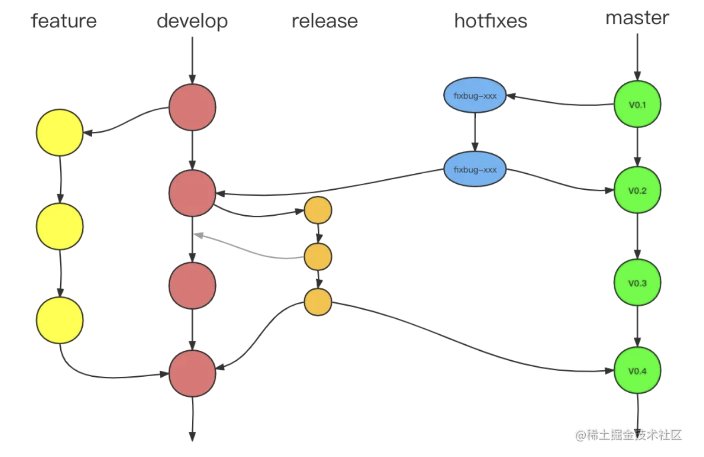

📒 Git 分支操作流程

在 Git Flow 中，有两个长期存在且不会被删除的分支：`master` 和 `develop`

- `master` 主要用于对外发布稳定的新版本，该分支时常保持着软件可以正常运行的状态，不允许开发者直接对 master 分支的代码进行修改和提交。当需要发布新版本时，将会与 `master` 分支进行合并，发布时将会附加版本编号的 Git 标签
- `develop` 则用来存放我们最新开发的代码，这个分支是我们开发过程中代码中心分支，这个分支也不允许开发者直接进行修改和提交。程序员要以 `develop` 分支为起点新建 `feature` 分支，在 `feature` 分支中进行新功能的开发或者代码的修正

> 注意 `develop` 合并的时候，不要使用 `fast-farward merge`，建议加上 `--no-ff` 参数，这样在 `master` 上就会有合并记录

除了这两个永久分支，还有三个临时分支：`feature branches`、`hotfixes` 以及 `release branches`

- `feature branches` 是特性分支，也叫功能分支。当你需要开发一个新的功能的时候，可以新建一个 `feature-xxx` 的分支，在里边开发新功能，开发完成后，将之并入 `develop` 分支中
- `hotfixes` 就是用来修复 BUG 的。当我们的项目上线后，发现有 BUG 需要修复，那么就从 `master` 上拉一个名为 `fixbug-xxx` 的分支，然后进行 BUG 修复，修复完成后，再将代码合并到 `master` 和 `develop` 两个分支中，然后删除 `hotfix` 分支
- `release branches` 是发版的时候拉的分支。当我们所有的功能做完之后，准备要将代码合并到 `master` 的时候，从 `develop` 上拉一个 `release-xxx` 分支出来，这个分支一般处理发版前的一些提交以及客户体验之后小 BUG 的修复（BUG 修复后也可以将之合并进 `develop`），不要在这个里边去开发功能，在预发布结束后，将该分支合并进 `develop` 以及 `master`，然后删除 `release`

📒 [大厂动态规划面试汇总，重量级干货，彻夜整理](https://mp.weixin.qq.com/s/-u7tnhD8YoOV9bkC62S6Pg)

⭐️ [通过几行 JS 就可以读取电脑上的所有数据？](https://mp.weixin.qq.com/s/1oDNxf5xHwlUUpJSVkqazg)

📒 [百行代码带你实现通过872条Promise/A+用例的Promise](https://mp.weixin.qq.com/s/A1uuU7DdBlUF-E6ZqlpOCw)

📒 [颜值爆表！Redis 官方可视化工具来啦，功能真心强大！](https://mp.weixin.qq.com/s/KIcn2TAwY58JGoWiz82Q2g)

⭐️ [「React进阶」react-router v6 通关指南](https://juejin.cn/post/7069555976717729805)
