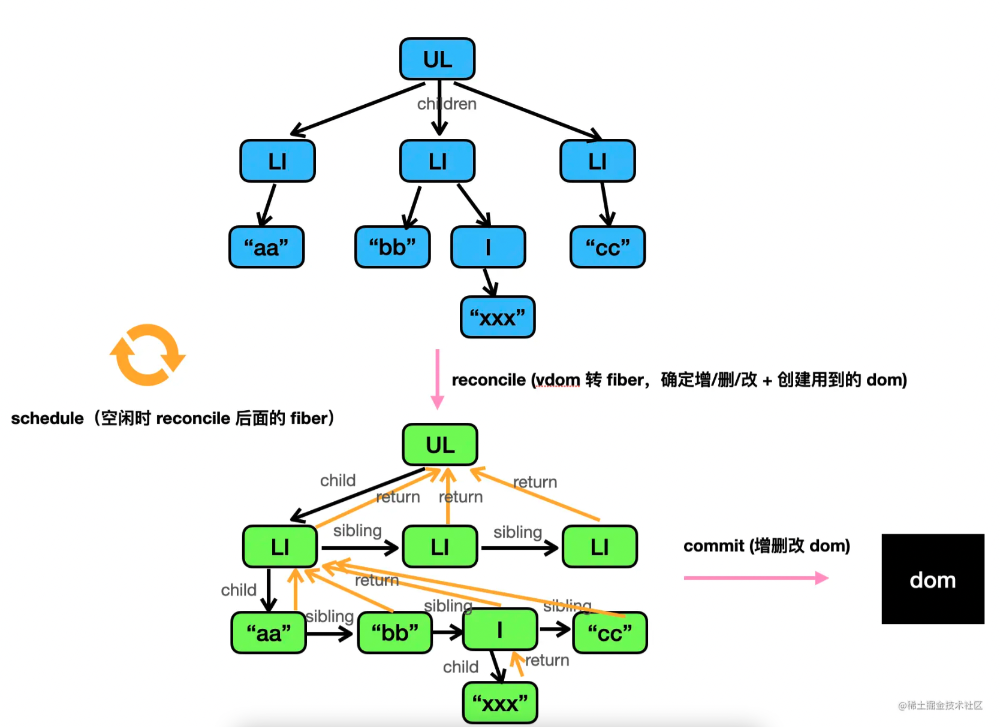

📒 [浏览器技术架构的演进过程和背景](https://juejin.cn/post/7035791029814951950)

📒 [从chromium源码来窥探浏览器的渲染](https://juejin.cn/post/7059408852390772767)

📒 [从 0 开始手把手带你搭建一套规范的 Vue3.x 项目工程环境](https://juejin.cn/post/6951649464637636622)

📒 为什么 React 中要使用 immutable 数据流

在 `PureComponent` 和 `memo` 中会将新旧 props 进行 **浅层比对**，逻辑非常简单：

```js
function shallowEqual (objA: mixed, objB: mixed): boolean {
  // 下面的 is 相当于 === 的功能
  // 只是对 + 0 和 - 0，以及 NaN 和 NaN 的情况进行了特殊处理
  // 第一关：基础数据类型直接比较出结果
  if (is (objA, objB)) {
    return true;
  }
  // 第二关：只要有一个不是对象数据类型就返回 false
  if (
    typeof objA !== 'object' ||
    objA === null ||
    typeof objB !== 'object' ||
    objB === null
  ) {
    return false;
  }

  // 第三关：在这里已经可以保证两个都是对象数据类型，比较两者的属性数量
  const keysA = Object.keys (objA);
  const keysB = Object.keys (objB);

  if (keysA.length !== keysB.length) {
    return false;
  }

  // 第四关：比较两者的属性是否相等，值是否相等
  for (let i = 0; i < keysA.length; i++) {
    if (
      !hasOwnProperty.call (objB, keysA [i]) ||
      !is (objA [keysA [i]], objB [keysA [i]])
    ) {
      return false;
    }
  }

  return true;
}
```

但浅层比较相当于只是比较第一层，还是会存在一些问题，如果修改深层嵌套的对象，浅层比较会认为相等。

为解决这个问题，可以手动在 `shouldComponentUpdate` 钩子中实现深层比对，但缺点就是浪费性能。最好的解决方案就是使用 immutable 数据流。immutable 对象内部采用的是多叉树的结构，只要有节点被修改，那么该节点和与之相关的所有父节点会直接拷贝到一个新的对象中（创建一个新的引用）。也就是说，修改任意一个子节点，改动都会冒泡到根节点，这样浅比较就能感知到数据改变了。

[React Hooks 与 Immutable 数据流实战](https://juejin.cn/book/6844733816460804104/section/6844733816548884487)

📒 操作 JavaScript 的 AST

`acorn`、`Espree`、`@babel/parser` 三种解析器用法说明

[操作 JavaScript 的 AST](https://juejin.cn/post/7061808830274863118)

📒 React fiber 架构浅析

在 React 16 之前，vdom 以递归的方式进行 patch 和渲染，一个 vdom 节点可以表示如下：

```ts
class VNode {
  type: string;
  props: Record<string, any>;
  children: VNode[];
}
```

在 React 16 之后引入了 fiber 架构，vdom 不再直接渲染，而是先转成 fiber，一个 fiber 节点可以表示如下：

```ts
class FiberNode {
  type: string;
  props: Record<string, any>;
  dom: HTMLElement; // 提前创建 dom 节点
  child?: FiberNode;
  sibling?: FiberNode;
  return?: FiberNode;
  effectTag: string; // 做 diff，确定是增、删还是改
}
```

在 fiber 架构中，将 vdom 树结构转成了链表，每个 fiber 节点的 `child` 关联第一个子节点，然后通过 `sibling` 串联同一层级的节点，所有的节点可以 `return` 到父节点：



先把 vdom 转 fiber，也就是 reconcile 的过程，因为 fiber 是链表，就可以打断，用 schedule 来空闲时调度（requestIdleCallback）就行，最后全部转完之后，再一次性 render，这个过程叫做 commit。

schedule 就是通过空闲调度每个 fiber 节点的 reconcile（vdom 转 fiber），全部 reconcile 完了就执行 commit。

reconcile 除了将 vdom 转 fiber 外，还会做两件事：一个是 **提前创建对应的 dom 节点**，另一个是 **做 diff，确定是增、删还是改**，通过 schdule 的调度，最终把整个 vdom 树转成了 fiber 链表。

commit 就是对 dom 的增删改，把 reconcile 产生的 fiber 链表一次性添加到 dom 中，因为 dom 节点都提前创建好了、是增是删还是改也都知道了，所以这个阶段很快。每个 fiber 节点的渲染就是按照 child、sibling 的顺序以此插入到 dom 中，这里每个 fiber 节点都要往上找它的父节点（之前保存的 `return` 指针），因为我们只是新增，那么只需要 `appendChild` 就行。

[手写简易版 React 来彻底搞懂 fiber 架构](https://juejin.cn/post/7063321486135656479)

📒 [Chrome 99新特性：@layers 规则浅析](https://mp.weixin.qq.com/s/Hnp2XddZPp3WAHrXBqEyAQ)

📒 WebVM.io：基于 Web 的“无服务端”虚拟 Linux 环境

浏览器端运行的 Linux 环境，基于 JavaScript 和 WebAssembly 的 CheerpX x86 虚拟化引擎驱动。虽然它不是一个完全基于 JavaScript 的项目，但它很好地展示了 Web 技术的发展程度。它已经内置了 Node v10.24.0，但要注意它首次加载速度可能会有点慢。

> https://webvm.io/

这里有一篇关于它如何工作的文章。

> https://leaningtech.com/webvm-server-less-x86-virtual-machines-in-the-browser/

📒 如何使用 Vue 3、Vite、Pinia 开发应用程序

非常完善的开发、测试、部署指南。

> https://labs.pineview.io/learn-how-to-build-test-and-deploy-a-single-page-app-with-vue-3-vite-and-pinia/

📒 用代码分割来提高打包 JavaScript 时的性能

> https://www.smashingmagazine.com/2022/02/javascript-bundle-performance-code-splitting/

📒 提升 VSCode 扩展插件的运行速度

插件开发者必读


> https://jason-williams.co.uk/speeding-up-vscode-extensions-in-2022

📒 Babel 发布 v7.17.0

该版本对 **装饰器提案** 的支持已稳定，还对装饰器的解析和转换进行了支持。

> https://babeljs.io/blog/2022/02/02/7.17.0

📒 使用 Streams 模块构建高性能的 Node 应用

> https://blog.appsignal.com/2022/02/02/use-streams-to-build-high-performing-nodejs-applications.html

📒 Node.js 新增 Fetch API

对 Fetch API （一般是浏览器端用来获取资源）的支持已经合并到 Node.js，将在提供 `‑‑experimental‑fetch` 标志后可以开启，Node v18 或者更高版本会默认启用。

> https://fusebit.io/blog/node-fetch/

⭐️ [来自未来，2022 年的前端人都在做什么?](https://mp.weixin.qq.com/s/triP_hXILSWq37DIGz4VNg)

⭐️ [最全的前端性能定位总结](https://juejin.cn/post/7052918009555320839)

📒 [接近天花板的TS类型体操，看懂你就能玩转TS了](https://juejin.cn/post/7061556434692997156)

📒 [2022年必会Vue3.0学习 （强烈建议）](https://juejin.cn/post/7057325585705467918)

📒 [如何利用 SCSS 实现一键换肤](https://juejin.cn/post/7062496975454732301)

📒 [手写 JS 引擎来解释一道赋值面试题](https://juejin.cn/post/7062258342546620423)

📒 10 分钟讲述 React 的故事

> https://www.youtube.com/watch?v=Wm_xI7KntDs

📒 2022 年值得关注的 React 趋势

> https://www.chakshunyu.com/blog/what-you-should-definitely-look-out-for-in-react-in-2022/

📒 React 18 中的自动批处理（Automatic Batching）

> https://blog.bitsrc.io/automatic-batching-in-react-18-what-you-should-know-d50141dc096e?gi=aa52794e9a07

📒 [React Mentions：在 Textarea 中提及某人](https://github.com/signavio/react-mentions)
