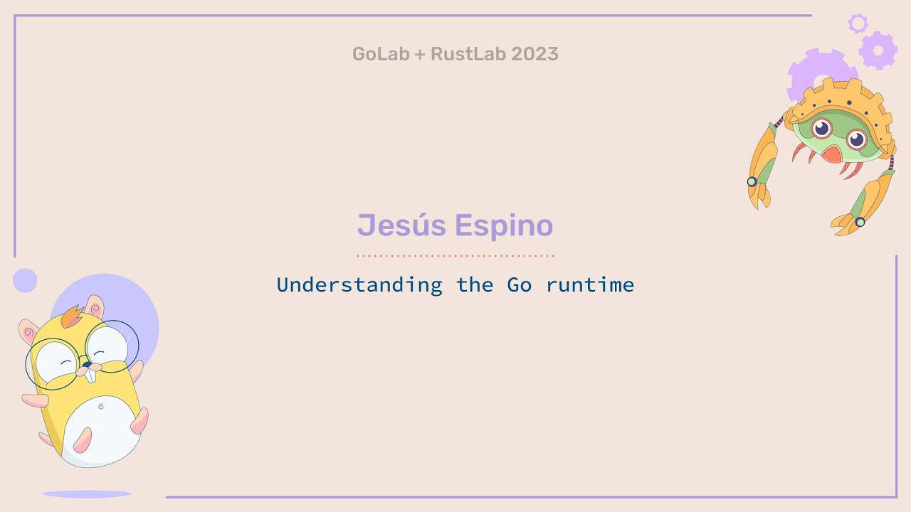

封面图：Understanding the Go runtime - Jesus Espino

## 🌟 AI 相关

[《In-context Learning with Retrieved Demonstrations for Language Models: A Survey》](https://arxiv.org/abs/2401.11624)。这篇题为 "In-context Learning with Retrieved Demonstrations for Language Models: A Survey" 的文章，主要讨论了语言模型，尤其是大型预训练语言模型如何通过获取的演示进行少量情景学习。这项技术能有效地改进学习过程的效率和可扩展性，并降低手动选择样例时的固有偏见。文章对此领域进行了广泛的研究回顾，对检索模型、检索训练过程和推理算法的不同设计选择进行了讨论和比较。

[使用 GPT4V+AI Agent 做自动 UI 测试的探索 | 京东云技术团队](https://juejin.cn/post/7316592794109198387)

[Gemini修bug神了！录网页视频把代码库甩给它就行，网友坐不住了：想要访问权限](https://mp.weixin.qq.com/s/ZSDCNDRu-tCkOlC9jz2j4w)

[一键开启 GPU 闲置模式，基于函数计算低成本部署 Google Gemma 模型服务](https://mp.weixin.qq.com/s/GXwftkv-UpDQSjiTMn9TFA)

[《Yi技术报告细节分享》](https://mp.weixin.qq.com/s/YDwL3dV-Fq5zcEyrL__NGw)。该文章分享了Yi模型的具体实现细节和思路，强调了模型设计围绕模型规模、数据规模和数据质量。Yi模型的预训练阶段数据处理流程包括启发式过滤、学习式过滤、聚类过滤以及去重等步骤，以提高数据质量。微调阶段，Yi模型仅采用了10K数据进行模型微调，强调数据质量胜过数量。在分词器、模型结构及微调参数方面，Yi模型采用了一系列优化措施，包括Transformer-Decoder结构、Grouped-Query Attention等。总的来说，Yi模型通过优化数据处理流程、微调策略、调整模型结构和参数等多方面实现了高效的技术实现。

[重新定义大模型推理！Google | 提出SELF-DISCOVER框架，大模型可自写推理结构！](https://mp.weixin.qq.com/s/lBXwSVvRHB2Yn0fYoOkDeQ)

[《斯坦福 && 微软 | 发布前端代码生成大模型：Design2Code-18B，助力前端自动化！》](https://mp.weixin.qq.com/s/cB5tgMUPqg8fsXjNrzQpbg)。这篇文章主要介绍了一种新的前端代码生成大模型：Design2Code-18B，它可以将网页视觉设计转换成功能性代码。文章首先介绍了将网页视觉设计转换成功能性代码的挑战性和现有方法的局限性，然后提出了Design2Code基准和多模态提示方法，以激发多模态大型语言模型（如GPT-4V和Gemini）的潜力。接着，文章介绍了开源的18B微调模型Design2Code-18B，它基于CogAgent-18B，在多种数据集上进行了预训练，并使用了Huggingface发布的WebSight数据集进行微调。最后，文章展示了Design2Code-18B在Design2Code基准上的优越性能，并提供了一些未来研究方向。

[可控文本生成新方法，人大&&南开 | 提出DATG架构，准确性提升19.29%，效率提升1倍](https://mp.weixin.qq.com/s/Pdp6_z_rxBl-kph41Lb8Ww)

[《Auto-Prompt | 大模型提示(Prompt)优化新方法IPC：可根据用户意图进行定向优化》](https://mp.weixin.qq.com/s/53jEDw58dkZlJAVzr31G8A)。这篇文章提出了一种名为 Intent-based Prompt Calibration（IPC）的系统，主要目的是通过使用合成案例样本来优化大型语言模型的提示工程。它基于模型生成的数据集进行提示优化，以解决大语言模型对给定提示的敏感性等问题。这种方法的核心思想是根据用户意图迭代细化提示。同时，文章还对 IPC 系统的整体架构和实现流程进行了详细介绍，并展示了一些实验结果。

[《更智能的 Agent，Plan-and-Execute Agents 计划和执行》](https://mp.weixin.qq.com/s/1d2_kHEQnug9iR0cU_0nAA)。这篇文章介绍了几种新型的智能 Agent 设计方法，包括 Plan-and-Execute Agents、ReWOO Agent 和 LLMCompiler。Plan-and-Execute Agent 设计法通过明确规划来优化智能 Agent 功能。ReWOO Agent 设计法凭借变量分配功能使得不必对每个任务都使用 LLM。LLMCompiler 则通过任务格式化为 DAG 来提高工具调用的效率。这些新型设计都在不同程度上优化了智能 Agent 的工作流程，提高了工作效率。

[《OpenAI Function Calling 与 LangChain Agent 工作原理及区别》](https://mp.weixin.qq.com/s/F2s3pKycoNDT7Z-6piRHWg)。这篇文章介绍了OpenAI Function Calling 与 LangChain Agent的工作原理及它们之间的区别。文章首先列举了大型语言模型的限制，并解释了为何需要Agent。然后，文章介绍了React Agent的工作方式，通过“Reason Only”（向内求索）、“Act Only”（向外探索）和“ReAct”（内外兼修）三种模式优化模型的功能。此外，文章还以一个简单的实例，解释了如何利用ReAct Agent来解答一个包含搜索和计算两个步骤的问题，展示了其实际应用的流程。

[《ReAct Agent 回答 RAG 系统中的复杂问题》](https://mp.weixin.qq.com/s/iM45toKEHr3_rJxuwbgp4w)。这篇文章主要讲述了“ReAct Agent 用于回答 RAG 系统中复杂问题的方式”。随着输入问题的复杂度升高，使用传统的聊天机器人已不能足够有效。于是，作者提出了利用 ReAct Agent，通过自然语言模型（LLMs）逐步规划并执行处理问题的步骤，并定义功能性工具（如时间计算、文本搜索、列表长度计算、百分比变化计算等）以辅助任务完成。这种方法能够更好地干预和控制问题的解决过程，从而提高任务的完成质量。

[更智能的 Agent，Plan-and-Execute Agents 计划和执行](https://mp.weixin.qq.com/s/1d2_kHEQnug9iR0cU_0nAA)

[ChatGPT也能画图？教你一键生成时序图、类图、流程图、状态图以及用例图](https://mp.weixin.qq.com/s/KF7joY-MkK4BZ8Rf8bLArw)

[三个被忽视的大模型提示](https://mp.weixin.qq.com/s/E2xwi9SNYQ7sdzhYlaDQFg)

[关于Sora和Stable Diffusion 3，你需要知道的一切](https://mp.weixin.qq.com/s/u2LCRgBhKKcGZhY29PjIng)

[消费级显卡可用！李开复零一万物发布并开源90亿参数Yi模型，代码数学能力史上最强](https://mp.weixin.qq.com/s/z6IFIuHawVZI6ZOfgvgKuA)

[详解大模型微调全流程](https://mp.weixin.qq.com/s/IBh3ytd3gtizAQd5PI2uig)

[南大俞扬教授：什么是world models/世界模型](https://mp.weixin.qq.com/s/UzC3J_TOzJPEx_86-lRwuw)

[深入浅出LangChain与智能Agent：构建下一代AI助手](https://mp.weixin.qq.com/s/Gi6pzD7wAMyzlCBSSWkVLA)

[尤洋教授：开源完整的Sora复现方案来了！](https://mp.weixin.qq.com/s/T9YRVRGMgkwRSTl7Movadg)

[《T-RAG=RAG+微调+实体识别》](https://mp.weixin.qq.com/s/8WYWrHyE4oryCgO9AemImA)。这篇文章名为"T-RAG=RAG+微调+实体识别"，主要介绍了T-RAG技术，这是一种将RAG架构与微调语言模型和实体树向量数据库相结合的方法，用于支持语境检索。它概述了在敏感文档的背景下如何保护数据隐私，以及如何在有限的计算资源和基于现有文档建立的小型训练数据集中保证用户提问的准确回答。文中还着重介绍了T-RAG的工作流程和实体树的作用。最后，还提出了一个新的评估指标“Correct-Verbose”，用以评价生成回复的质量。此研究不仅是理论研究，也是实践中LLM应用的经验总结，具有实际的指导意义。

[《高级 RAG（Self-Reflective RAG）》](https://mp.weixin.qq.com/s/de3UxM9WTrHNjnOKSny0aw)。这篇文章名为"高级 RAG(Self-Reflective RAG)"，主要介绍了Self-Reflective RAG的理念和工作流程。在基本的RAG pipeline中，我们的过程往往受限于被动的检索和生成，而实际操作中，我们需要根据生成的结果进行优化，如改变问题或筛选和排列内容。为了解决这个问题，文章介绍了一种新的自我修正框架，包括Corrective RAG(CRAG)和Self-Reflective RAG。这两种RAG都围绕着对检索和生成内容的评估和反馈进行自我修正，并通过特定标识进行调控。在一定条件下，进一步改进了RAG，使其产生更好的检索和生成效果。

[RAG不够聪明？打造更强大的智能体](https://mp.weixin.qq.com/s/WuJEubctUDsAmdhHcDItAg)

[Anthropic发布Claude3，效果已超越GPT4](https://mp.weixin.qq.com/s/b_eWGauwi6v0w4CoSOnU5w)

[从0开始预训练1.4b中文大模型实践](https://mp.weixin.qq.com/s/nMWTuKBnQVjgAM7Du6oOFQ)

[分类算法入门：以鸢尾花数据集为例](https://mp.weixin.qq.com/s/W5W582CqxvRhF3wnKwIdiQ)

[《万字详解LLM Agents的现状，问题与未来》](https://mp.weixin.qq.com/s/fkRG7n4tOQKwU85xiEx0Eg)。这篇文章名为"写在跨年之前：聊聊LLM Agents的现状，问题与未来"，主要涉及到LLM Agents的当前状态，面临的问题和未来的可能发展。文章探讨了包括全参微调、Prompt Tuning、LoRA、P-Tuning等在内的SFT(Selective Fine Tuning)范畴的各种技术。其中尤其强调了对于{prompt，response}的单轮问答对的微调是最简单的SFT实现方式。具体的内容细节大概需要阅读原文才能获得更深入的理解。

## ⭐️ Go & 云原生 & Rust 相关

[《Robust generic functions on slices》](https://go.dev/blog/generic-slice-functions)。这篇文章名为"Robust generic functions on slices"，主要探讨了Go的slices包如何提供对切片进行操作的通用函数。该文章首先介绍了如何通过类型参数，一次性为所有类型的切片编写类似slices.Index等函数，而无需针对每种不同的元素类型重新实现。随后，文章深入讲述了新的函数（如Insert, Replace，Delete等）如何修改切片，并通过详述切片在内存中的表现形式及其对垃圾回收器的影响，来帮助读者理解这些函数的工作方式和正确使用它们。文章特别指出，新的Delete函数提供了更清晰地表达程序员意图的方式，而且它不需要分配新的数组，这样就可以在适当时清除无用的元素，帮助垃圾回收。文章强调，调用这些函数后，必须认为原始切片已无效，因为底层数组已被修改。最后，文章还讨论了在处理内存泄漏和元素零值设置等问题时的策略和选项，它们在新版本Go给出的解决方案，以及这些改变可能导致的一些测试问题。此外，作者鼓励开发人员正确使用新功能，并尽量避免上述列举的陷阱。

[《Routing Enhancements for Go 1.22》](https://go.dev/blog/routing-enhancements)。这篇文章名为"Routing Enhancements for Go 1.22"，主要介绍了 Go 1.22 版本中 net/http 包的路由器提供的新特性：方法匹配和通配符。这些新特性让你可以使用模式，而非 Go 代码，来表达常见的路由。这种新功能，尽管简单易懂，但要选择出多个匹配请求的最佳模式却是一项挑战。文章还详细阐释了如何在新版 Go 中使用这些新特性，以及这些引入的变化如何影响了 ServeMux 方法 handle 和 handleFunc 。此外，还描述了新模式如何更具优先级，并解释了其背后的原理。同时，为了保持新旧版本的兼容性，作者们也努力使新的模式语法能覆盖旧的，并使新的优先级规则能泛化旧的规则。总体上，这些改变是 Go 语言团队不断努力使 Go 成为构建生产系统的优秀语言的一个持续过程的一部分。

[听GPT 讲Rust源代码--compiler(6)](https://mp.weixin.qq.com/s/IH1FGDpClrsnlfjg7OF3lg)

[使用Apache Kafka的Golang实践指南](https://mp.weixin.qq.com/s/JCU3dwkwpMP3qMKqg9ed6g)

[《Go 为什么不支持从 main 包中导入函数》](https://mp.weixin.qq.com/s/RFsHfFByarSRAA-f1Rs13g)。这篇由煎鱼撰写的文章，题为 "Go 为什么不支持从 main 包中导入函数?"，对于这个话题进行了深度解析。其首先提到，虽然Go的规范并没有明确禁止从main包中导入函数，但我们在实际运行中会被拒绝，提示main包是一个程序而非可以导入的包。这一现象的原因来自于经过多次变动的规定，如2011年移除了 "程序中的其他包都不能命名为 main" 的要求，然后在2015年又新增了限制。这样的变化主要是为了避免增加复杂度和不安全性。比如，一个函数可能会做出自己拥有完全控制权的假设，所以如果引入多个main包中的函数，可能会产生在初始化顺序、全局变量的注册等方面的冲突。这篇文章认为Go官方的做法在理论上可以解决复杂度和安全性问题，但对于有历史债务的项目，对于需要维护多个Go项目工程，相当于磨灭了一条道路，其实比较尴尬。

[《fasthttp是如何做到比net/http快十倍的》](https://mp.weixin.qq.com/s/zxLO4IhLqQmIaUDzwwjU1w)。这篇文章讲解了fasthttp如何做到比net/http快十倍的原理。fasthttp相比于net/http在处理流程上有所差异，net/http是一个连接新建一个goroutine，当连接数非常多的时候会给系统带来一定的压力。而fasthttp则是建立了workerPool，每个workerChan在后台都会有一个Goroutine来处理其中的连接。此外，fasthttp的快速也得益于几个方面的优化：连接复用，大量使用了sync.Pool进行内存复用以及通过unsafe.Pointer指针进行\[\]byte和string转换来避免内存分配和拷贝的消耗。

[《万字长文讲解Golang pprof 的使用》](https://mp.weixin.qq.com/s/fx-FTVpM3CXIPUwTC_juDQ)。这篇文章主要讲述了Golang的pprof工具的使用。pprof工具是Golang中用于性能分析的一个工具，它可以分析出cpu使用情况、内存占用、阻塞情况、线程和协程等信息。文章中详细阐述了如何使用此工具，主要有两种方式，一种是通过http接口的方式暴露出pprof的采集控制界面，另一种是在程序中通过代码来启动相应指标的采集示例。文章还详细介绍了如何解析通过这两种方式获取的输出信息。本文的主要目的是将pprof工具的使用方式用思维导图的形式展示出来，这样可以帮助读者更好地理解和使用pprof工具。

[《一篇实用的关于云上K8s应用分账实践》](https://mp.weixin.qq.com/s/xYvMI0JieO6RxHIdWf1ujQ)。本文讲述云上Kubernetes（K8s）应用的成本分摊实践，涵盖了成本分摊的核心概念及阿里云ACK FinOps套件的应用。文中首先以前期预算为集群规划的依据，并讨论了随着业务发展对成本分摊精准度的提升需求。介绍了如何根据Pod的核/时成本，通过ACK集群、计算节点、命名空间和应用Pod这四个维度进行费用分摊。文章还分析了单资源和混合资源分摊模型，并讨论了如何设置Request和Limit来优化资源利用。对于多云和混合云场景，分享了如何通过ACK One实现统一管理和成本分析。针对复杂业务场景，讲述了自定义定价模版的使用方式，允许通过配置实现成本定制需求。对于追求细节管理和精细化运营的团队，这篇文章提供了宝贵的指导。

[《如何使用 K8s 两大利器"审计"和"事件"帮你摆脱运维困境》](https://mp.weixin.qq.com/s/6xx3-qow8A5Hdp_72jswow)。这篇文章主要讲述了如何使用 Kubernetes（K8s）的"审计"和"事件"功能来帮助进行日常集群运维工作。文章首先指出了运维工作中可能出现的一些问题，例如应用被删除、Apiserver负载突变、集群节点出现问题、节点自动扩容等。随后，文章进一步解释了 Kubernetes的审计和事件是如何运作的，强调了善用这两种工具可以提高集群的可观察性，为运维工作带来极大的便利。总的来说，这篇文章为运维人员提供了一种解决方案，通过使用 Kubernetes的审计和事件，可以更好地管理和监测集群的状态。

[【Go 工具】竞态条件检测神器 Race Detector](https://mp.weixin.qq.com/s/lxEAFe2Ewmc8YvTqn8UcLQ)

[使用Redis入门Golang](https://mp.weixin.qq.com/s/Y67J4_D1yyMa-eb7XmgTcA)

[一道面试题: Top K 问题](https://mp.weixin.qq.com/s/qDFM-nVo-jeh9VdcBfMreA)

[《理解 Docker 容器中 UID 和 GID 的工作原理》](https://mp.weixin.qq.com/s/sTd3SVh0swGTnaGugsw1SA)。这篇文章详细解析了 Docker 容器中 UID 和 GID 的工作原理。首先，作者概述了用户名、组名、用户ID（UID）和组ID（GID）在容器内运行的进程与主机系统之间的映射对于构建安全系统的重要性。随后，文章分析了uid/gid在Linux系统的安全性，强调了单一内核概念以及uid/gid的分配方式。接着，作者运用实例解释了Docker运行的过程以及如何通过Dockerfile定义和启动不同用户。最后，文章讲述了如何掌控和控制容器的访问权限。在阐述以上内容的同时，文章也提供了一些实际示例来说明这些观点。

[《如何基于Docker镜像逆向生成Dockerfile》](https://mp.weixin.qq.com/s/yUuo1IjeXY78_5u4QpkuTA)。这篇文章介绍了如何将Docker镜像逆向生成Dockerfile。文章主要讲述了利用开源工具Dedockify的操作方法与工作原理。该工具通过Python脚本，利用存储在每个镜像层旁边的元数据，逐步遍历层级树，收集与每个层相关联的命令，重建镜像构建过程中执行的命令序列，从而得到近似的Dockerfile。不过，因为无法访问执行原始docker build命令时存在的构建上下文，如果使用了COPY或ADD指令，生成的输出可能不完全匹配原始的Dockerfile。

[《通过多阶段构建减小Golang镜像的大小》](https://mp.weixin.qq.com/s/KkRWQyljuo86-XbBxEnGPA)。本篇文章主要介绍了如何通过多阶段构建减小Golang镜像的大小。首先，作者提出了一个通用的Dockerfile，并指出其生成的镜像大小超过300MB，主要因为包含了所有的Golang工具。然后，作者提出了多阶段构建的方法，它能从不同的基础镜像构建，有选择地将文件从一个阶段传递到下一个阶段，从而减小镜像大小。在本例中，通过二级构建，镜像大小已降至11.7MB。最后，还探讨了使用名为scratch的空白镜像进一步减小镜像大小的可能性，使得镜像最后降至6.34MB，但作者强调这需要慎重考虑，因为最后生成的镜像将完全没有任何工具。

[《k8s 到底是什么，架构是怎么样的》](https://mp.weixin.qq.com/s/dckA1ezcABndN5WSg1BOBA)。这篇文章主要讲述了 Kubernetes（K8s）的基本概念、架构和工作原理。Kubernetes，因单词过长，我们通常简化为k8s。k8s 是一种容器的协调工具，位于应用服务和服务器之间，能以策略的方式协调和管理多个应用服务。通过一个 yaml 文件的配置，可以定义应用的部署顺序等信息，自动部署应用到各个服务器上，还能让它们崩溃后自动重启，可以自动扩容和缩容。Kubernetes 的服务器分为两部分：控制平面和工作节点，前者负责控制和管理各个节点，后者则负责实际运行各个应用服务。k8s 的命令行工具为 kubectl，用于执行各类操作命令。

[《Go 泛型有没有可能在后期改为 `<>` 尖括号》](https://mp.weixin.qq.com/s/vjmntyGwzURz_elg27vpXg)。这篇文章主要讨论了Go语言在处理泛型时，为何并没有采用类似Java和C++的 `<>` 尖括号表示法，而是选择了中括号 `[]`. 首先，使用尖括号可能导致语义混淆，如 `a, b := w < x, y > (z)` 此句，如果使用尖括号，程序可能在编译阶段无法确定该行表达式的具体含义。其次，使用圆括号也会导致同样的问题，比如 `func F(T any)(v T)(r1, r2 T)`, 无法快速准确判断出参数和返回值部分。此外，Go官方也不希望使用非ASCII的字符。作者还提到社区中对Go的处理方式存在一些争议，部分社区成员认为如果使得编译器解释尖括号不再困难，就可以采用这种符号。然而，总的来说，基于已有的实践和规范，Go语言在未来可能也不会改变其泛型的表示方式。

[《Rust中channel的使用》](https://mp.weixin.qq.com/s/arI9sip-5JH9YSu45XJ83w)。这篇文章主要介绍了Rust编程语言中Channel的用法。其中，Channel是Rust中用于在不同线程间传递信息的通信机制，实现了线程间的消息传递。每个Channel由发送端和接收端两部分组成，其设计理念是“通过通信来共享内存，而非通过共享内存来通信”，以此避免了数据竞争和共享内存的复杂性。该文章进一步详细介绍了如何在Rust中创建和使用Channel，并给出了相关代码示例。最后，文章阐述了多种Channel模型，包括Rust标准库中所使用的MPSC（多生产者，单消费者）模型。

[K8s部署方式大全：从基础到进阶，一文带你掌握所有技巧](https://juejin.cn/post/7272006755266002959)

[k8s从入门到精通 -- 更适合中国宝宝体质](https://juejin.cn/post/7301584578342289423)

## 📒 后端相关

[《万字+33张图探秘OpenFeign核心架构原理》](https://mp.weixin.qq.com/s/NABg5tGizHsmdXgUO6NeVw)。本篇文章深入探讨了SpringCloud核心组件OpenFeign的核心架构原理。文章分为四个部分，首先解释原始Feign的使用和基于SpringCloud的进化过历程；然后详细讲解了Feign底层工作原理，依赖于JDK动态代理和核心组件如Contract、Encoder、Decoder等；接下来分析了SpringCloud是如何整合Feign的，并且讨论了OpenFeign的多种配置方式及其优先级；最后，文章通过丰富的图示和代码示例，使读者可以更好地理解并运用这一工具。这篇文章对于理解和运用OpenFeign非常有帮助，无论是对于初学者还是有经验的开发者。

[《三万字长文：如何去排查JVM内存问题》](https://mp.weixin.qq.com/s/1Qe29y3nrbi39Kpaspme7Q)。这篇文章是一份详尽的指导，讲述了如何排查JVM内存问题。文中首先定位了技术问题的范围，确定适用于JDK8至JDK11。接着，作者提出了系统化的排查原则，并提供了一步步的诊断流程，从基本信息收集、判断内存增长原因，到具体分析内存问题的可能来源。文章详细介绍了如何利用不同的命令和工具（如jmap、jstat、Arthas等）进行详细的分析，并根据内存使用情况，向读者展示了如何确定是堆内存问题还是堆外内存问题。总之，文章为那些需要深入理解和处理JVM内存问题的开发者和运维人员提供了宝贵的知识和技巧。

[《如何避免MYSQL主从延迟带来的读写问题》](https://mp.weixin.qq.com/s/WLPo8s_M3AzxwB3o3ehY3w)。这篇文章讨论了如何处理在MySQL主从部署架构中普遍存在的主从同步延迟问题，以保持读写操作的一致性。文章首先介绍了主从延迟产生的场景及其对读写分离原则的影响。然后，详细解释了主从复制的原理，并提出了两种避免主从数据不一致的技术方案：一是使用select master_pos_wait函数来等待从库同步至特定的binlog位置点；二是在开启GTID模式的情况下，通过select wait_for_executed_gtid_set函数检查GTID集合是否已同步。这两种方法均旨在确保从库数据的准确性，从而整体上减轻主库的压力。总体上，文章为MySQL数据库管理员提供了缓解主从延迟导致的读写问题的具体实施方案。

[《这些年背过的面试题——ES篇》](https://mp.weixin.qq.com/s/dt_14etV_2ynAmyMa_uyug)。这篇文章是一篇针对Elasticsearch(ES)的面试指南，它涵盖ES基础知识点和面试过程中常见问题。内容包括ES的功能特性介绍（如分布式架构、全文搜索、数据分析等）、主要的使用场景描述、与其他搜索引擎的对比（Lucene和Solr）、以及ES的基本概念解释。文章还详细探讨了ES的高级特性，如映射、DSL查询、聚合分析和智能搜索建议器。此外，作者还分享了关于数据索引优化的实战技巧和策略，提供了写优化、读优化和索引重建的方案，这些方案对ES数据存储和查询的性能有显著影响，最后还对Deep Paging性能问题提供了解决方法。对正在准备面试或者希望巩固ES知识的读者而言，这篇文章是一个宝贵的资源。

[《什么是MySQL锁？有哪些锁类型》](https://mp.weixin.qq.com/s/gAJFm3q5510PfRBe4F11PQ)。这篇文章详细地介绍了MySQL中的锁定机制及其类型。起初概述了锁的作用，即协调多进程或线程对资源的并发访问，在数据库环境下，锁对于保持事务的正确性与一致性至关重要。作者明确区分了MySQL中锁的级别，从全局锁、表锁（读锁、写锁）到元数据锁、意向锁，直到行锁的多种形式（记录锁、间隙锁和临键锁）。文中还探讨了AUTO-INC锁的作用和相关优化，举例说明了其在INSERT操作中的应用。此外，文章也涉及了如何根据不同的情况优化锁的使用以及如何避免由锁产生的性能瓶颈。这篇文章为理解MySQL的各种锁类型和锁机制提供了宝贵的信息，特别对于数据库管理员和那些需要管理并发数据访问问题的开发人员来说，具有很高的实用价值。

## 📒 前端相关

[Vue 团队正式开源 Rolldown：基于 Rust 的超快 JavaScrip 打包工具！](https://mp.weixin.qq.com/s/m-Ae6dbFuW22u2xSDWcciw)

[打造舒适的vscode开发环境](https://mp.weixin.qq.com/s/MVR5rV2LkH8_GHCtP6SHug)

[相比于 Node.js，Deno 和 Bun 到底能带来什么](https://mp.weixin.qq.com/s/pY4-RqqamTmPXnRPfw0hRA)

[MDH Weekly 122 - 《招人》](https://mp.weixin.qq.com/s/yBTK4Rds28aJ88mVgkoYJA)
