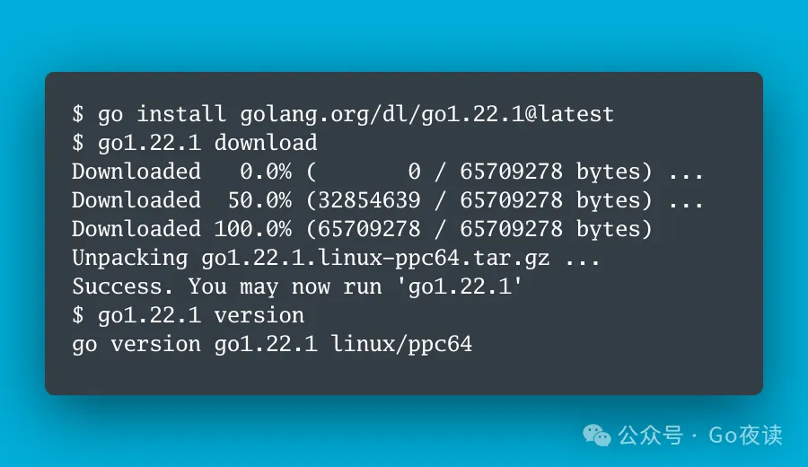

封面图：Go 1.22 发布第一个安全补丁

## 🌟 AI 相关

[《Prompt engineering》](https://docs.anthropic.com/claude/docs/prompt-engineering)。文章介绍了在使用Anthropic的Claude模型时，如何通过prompt engineering（提示设计）提升其性能。提示设计是一个经验科学，需要通过反复迭代和测试来优化提示的表现。文章建议定义清晰的任务和成功标准，并通过测试驱动的开发方法来优化提示。还包含了一些技术，比如清晰直白的指令、使用示例、赋予Claude特定角色、使用XML标记、分解复杂任务等，以提高输出质量和一致性。这些技巧帮助用户更好地利用Claude完成特定的用例。

[《Transformer前馈神经网络--Y=Wx+b公式却是人工智能领域的核心》](https://learning.snssdk.com/feoffline/toutiao_wallet_bundles/toutiao_learning_wap/online/article.html?item_id=7160681479788298504&app_name=news_article)。这篇文章分析了Transformer模型中前馈神经网络的重要性，特别强调了其核心公式Y=Wx+b的重要作用。作者提到输入矩阵在经过multi-head attention机制和add&norm操作后，由前馈神经网络经历两次线性变换和一次ReLU激活函数处理。这一过程确保无论输入数据如何变化，输出数据的维度都保持不变，从而保持数据的一致性并方便模型分析。

[《Devv AI 是如何构建高效的 RAG 系统的》](https://v2ex.com/t/1000319)。本篇文章探讨了Devv AI公司构建高效Retrieval Augmented Generation（RAG）系统的策略。RAG系统结合了语言模型、外部知识集合和特定场景所需知识，以提升搜索效能。作者提到，通过Go和Rust构建高并发架构、使用多种数据嵌入技术及优化召回机制来提高性能。文章指出，为了达到更高的效果，需要根据业务实际进行定制化优化，没有通用最佳实践，需要实际尝试和评估。

> https://twitter.com/Tisoga/status/1731478506465636749?s=20

[《OpenAI科学家Andrej Karpathy力荐，23年必读的大语言模型论文清单》](https://mp.weixin.qq.com/s/mt9W8Mf0LbZjbuRObyeWeQ)。文章由OpenAI的科学家Andrej Karpathy推荐，是对大语言模型(LLM)领域重要文章的整理。这份清单涵盖LLM的训练、运行、应用和未来发展方向，包括安全挑战。清单提及重要论文如《Attention Is All You Need》（提出了Transformer架构）、《Language Models are Unsupervised Multitask Learners》（关于GPT-2）、《Training Compute Optimal Language Models》等，并探讨了如何在现实世界中安全地集成并使用LLM。清单强调了追踪当前研究与保持思维前沿性的重要性。

[《阿里出品!7B最强多模态文档理解大模型mPLUG-DocOwl 1.5》](https://mp.weixin.qq.com/s/miNmrCt3brcPrrDXFe8rKA)。文章介绍了由阿里巴巴开发的mPLUG-DocOwl 1.5模型，这是一个7B参数级别的多模态大型语言模型（MLLM），专注于文档图片的结构化理解。模型通过统一的结构学习策略，在不同文档理解基准测试上取得了优异效果。文章提到了模型结构、训练策略、训练数据及其在多任务微调中的应用。mPLUG-DocOwl 1.5的性能在开源模型中处于领先地位，但与闭源模型相比在某些方面仍有差距。团队计划进一步优化并开源模型，促进社区的讨论与合作。

[《Good Data is All You Need，训练LLM数据是关键》](https://mp.weixin.qq.com/s/mZbXfb99zOOjeL6DjrVfyA)。本文探讨了在大型语言模型（LLM）训练中，数据的重要性、数据集的构成和数据质量。文章强调了高质量数据对模型性能的决定性影响，介绍了数据集应包含目标任务数据及相关迁移能力训练数据。文章详细讨论了在预训练、持续预训练和有监督微调阶段的数据混合策略，并指出避免“遗忘”问题的重要性。对于提升数据质量，建议提供丰富的任务信息和内逻辑，利于模型理解和泛化。最终，文章强调了结合数据多样性和解释性的必要性，以提升模型的学习效果和泛化能力。

[《融合RL与LLM思想，探寻世界模型以迈向AGI》](https://mp.weixin.qq.com/s/IdkFE-HuxGtDihlIc7BeDA)。本文深度分析了大型语言模型（LLM）与强化学习（RL）理论的结合，以及它们共同对人工通用智能（AGI）发展的影响。文章以AlphaGO、AlphaZero、AlphaDev这些模型为基础，讨论了深度学习和强化学习之间理论与实践的融合。重点探讨了Algorithm Distillation（AD）这一概念，这是将RL过程细粒度地嵌入到LLM中，使LLM能学习和压缩RL领域的深度洞察。此外，文章预测了AGI达到超人类智能（ASI）的潜在路径，并指出当前AI在LLM与RL层面上的缺失和未来发展的可能方向。

[《高性能 LLM 推理框架的设计与实现》](https://mp.weixin.qq.com/s/zys9KvQWbbdRHkOyhzZqUw)。文章从多个技术角度深入探讨了大型语言模型（LLM）的高性能推理框架设计。详细介绍了LLM推理的Prefill和Decoding两个阶段，以及测量推理性能的四个核心指标：吞吐量(Throughput)、首字延迟(First Token Latency)、延迟(Latency)和每秒请求数(QPS)。文章强调了Prefill阶段尽管计算量大但占比小，而Decoding阶段则数量庞大，是性能优化的关键。提出了多项优化策略，包括流水线前后处理、动态批处理和KV缓存量化等，有效提升系统的QPS和吞吐量。还讨论了包括FP8量化在内的多种硬件优化手段，旨在提供解决大模型高效推理的综合方案。

[《超越 GPT-4V 和 Gemini Pro!HyperGAI 发布最新多模态大模型 HPT，已开源》](https://mp.weixin.qq.com/s/-7Tz3g7cOV05rOyfA6XsvA)。HyperGAI团队推出的多模态大模型HPT，在多项基准测试中胜过GPT-4V和Gemini Pro。HPT包含HPT Air和HPT Pro两个版本，强调多模态理解并支持开源。HPT框架整合了视觉编码器和大语言模型，通过其创新组件H-former实现视觉与语言的紧密对齐。H-former处理视觉输入，生成可与语言模型联用的视觉嵌入。HPT在多模态数据集上的训练显示了其出色的理解、推理和创造力，尤其在MMMU及其它多模态测试中表现突出，同时展现了良好的泛化能力，这表明多模态大模型研究进展显著。

[《大模型推理核心技术:Continuous Batching详解》](https://mp.weixin.qq.com/s/77vlWgN6WkL3jL-6AJ0VAg)。文章深入探究了大模型推理中的Continuous Batching技术，从历史发展到现代架构进行了详尽的论述。阐释了在Transformer出现前后，Batching如何适应不同计算模型需求，特别是如何解决输入序列和批次大小变得可变的问题。分析了Continuous Batching的两种主要策略：ORCA框架的Iteration-level和Selective Batching，介绍了vLLM和FastGen等变种实现方法。通过对Continuous Batching在执行、资源管理、延迟均衡等方面的讨论，以及提及商汤LightLLM和TensorRT-LLM的应用案例，突出了该技术在推进AI服务效率的重要作用。

[《第二篇:ChatGPT背后强大而神秘的力量:用最简单的语言讲解Transformer架构之Embedding》](https://mp.weixin.qq.com/s/vDPdgnKeYnLtHfN73ZJxRg)。文章深入浅出地解释了Transformer架构中词嵌入（Embedding）的概念，包括其两种实现方法：稀疏表示法（如词袋模型和TF-IDF）和密集向量表示法（如Word2Vec和GloVe）。作者还介绍了如何使用欧氏距离、曼哈顿距离、点积和余弦距离计算词嵌入相似度的方法，并通过易懂的例子和代码实现。文章旨在让读者理解词嵌入对于语义理解的重要性，以及它在各种自然语言处理（NLP）任务中如何起到了核心的作用。

[《一文搞懂Transformer架构的三种注意力机制》](https://mp.weixin.qq.com/s/_IrB7oWn-xckPi_QoAEu4g)。本文是系列讲解Transformer架构的第四篇，重点讲解了核心组件注意力机制的三种形式。文章首先解释了注意力机制的概念，然后详细阐述了Transformer注意力层的工作原理，包括基础知识、理解Q、K、V矩阵，以及交叉、全局自注意力、因果注意力层的不同作用。此外，还介绍了位置编码，解释了其对位置信息的编码方式，以及如何通过正弦波函数来实现。文章最后描述了多头注意力机制，分析了其优势和如何通过将矩阵拆分为多个"头"来同时关注序列的不同特征。通过深入理解和比较这些注意力层与机制，文章帮助读者进一步认识Transformer模型的强大功能与效率。

[《TensorRT-LLM初探(二)简析了结构，用的更明白》](https://mp.weixin.qq.com/s/Jk-AK84sllBbkDDpvkv62w)。本文针对NVIDIA的TensorRT-LLM进行了深度解析，为使用者提供了一份快速入门指引。详细介绍了TensorRT-LLM的基本架构和组成，包含TensorRT库、FasterTransformer的设计以及其他组件，同时强调了大部分代码开源但包含一些闭源部分。还讨论了结合Triton Inference Server部署TensorRT-LLM的方式。文章解读了大模型推理过程中的动态batch（In-flight Batching）和Paged KV Cache技术，并提到了TensorRT-LLM对多卡支持的实现。最后，对于性能调优，还介绍了TensorRT-LLM独特的kernel性能优化以及量化策略。

[《谈谈我对 AIGC 趋势下软件工程重塑的理解》](https://mp.weixin.qq.com/s/UFMxQB9sUC5I0y86nfzKjw)。文章讨论了人工智能生成内容（AIGC）趋势对软件工程的影响，主要包括四个方面：AI作为软件开发不可或缺的部分、AI对软件研发的挑战和智能化机遇、企业实施软件研发智能化的策略与途径以及可落地的智能化软件研发工具。作者指出，在大模型时代，智能代码助手如Github Copilot显著提高了开发效率。AI的应用让开发者能专注于创新而非日常任务，而研发的智能化不仅改善了工作效率，还有助于处理软件本质的复杂性。文章还提到，利用AI工具如通义灵码可以增强个性化开发体验，并促进企业数字资产的增值。最终，作者建议采用分阶段方法实现软件研发智能化转型。

[《如何通过Vec2Text提升RAG的可解释性》](https://mp.weixin.qq.com/s/eaKPOvww0mqjvtE2KS2YrA)。这篇文章深入分析了Cornell University的研究团队发表的论文《Text Embeddings Reveal (Almost) As Much As Text》，介绍了一种名为Vec2Text的方法，它能从文本嵌入中恢复原始文本，有助于评估文本嵌入的隐私泄露风险。Vec2Text采用迭代修正的方式逐步重建文本，通过训练好的语言模型不断生成与目标嵌入更接近的文本。实验表明，Vec2Text在多个数据集和领域上能成功重建文本，显示出跨域文本恢复的有效性。同时，文章也探讨了Vec2Text的创新点、存在的不足，以及未来提高长文本恢复能力和减少嵌入模型查询次数的可能方向。

[《Transformer扩散模型的先驱之作:DiT、PixArt、HDiT》](https://mp.weixin.qq.com/s/eJMpoJCm0XcctRHrjfLhUQ)。文章综合介绍了三个重要的Transformer扩散模型结构：DiT、PixArt与HDiT，并对各自的特点和贡献进行了阐述。DiT以其可扩展性受到关注，通过遵循标准的Transformer架构进行设计，继承并改进了ViT的设计思想。PixArt由华为诺亚方舟实验室提出，是一个高效的文本到图像扩散模型，通过优化训练策略和数据集构造，显著降低了训练成本。HDiT则为Stability AI公司提出的沙漏形扩散Transformer，同样关注于图像生成。文章详细分析了这些模型的构造、优化和应用效果，展示了它们在图像生成领域的先进技术和潜力。

[《让 LLM 稳定输出 JSON》](https://mp.weixin.qq.com/s/F1FaJN1yUpDivuw0eoMcYA)。文章探讨了如何使大型语言模型（LLM）稳定输出 JSON 数据的方法，以及这些模型如何在高层次上工作。LLMs（如 ChatGPT 和 GPT-4）通常是自回归的，通过逐字预测来生成文本。文章介绍了原型系统 ReAct，这是一个通过Prompts来引导LLM产生特定格式输出的工具。通过训练，ReAct 可以解析工具名称和参数，以及调用工具和重复续写过程，直至获得最终答案。文章通过 COND_DATA_PROMPT 实践展示了如何生成用户问题的 JSON 结构，证明了在正确设定下，LLM 能可靠地输出所需的 JSON 格式，利用大模型的续写能力完成复杂的数据处理任务。

[《没等来OpenAI，等来了Open-Sora全面开源》](https://mp.weixin.qq.com/s/vdr1WBCQVr9aS6bJYcdlRA)。文章报道了Colossal-AI团队开源了一个类似OpenAI Sora视频生成模型的版本——Open-Sora 1.0，该模型包括完整的训练和数据处理过程。Open-Sora采用了Diffusion Transformer（DiT）架构，引入空间-时间注意力机制的STDiT模型。模型通过三个阶段：大规模图像预训练、大规模视频预训练和高质量视频数据微调，逐步提升生成质量。GitHub上提供的资源让AI爱好者可以轻松复现并生成视频内容，实现了在视频生成方面的成本节约与效率提升。团队承诺持续优化项目，实现更好的视频内容生成。

[《刚刚!马斯克开源 Grok:参数量近 Llama 四倍，成全球最大开源模型》](https://mp.weixin.qq.com/s/mWQGmp7eCMRnDxcgqicKQw)。本篇文章详述了马斯克通过其AI公司xAI开源了GroK-1，这是一个具有3140亿参数的混合专家系统模型，是迄今为止开源模型中最大的一个。它的参数量是Llama模型的四倍多，尽管如此，谷歌的switch transformer以1.6T参数保持公开记录。这次开源使用的是Apache-2.0许可，提供基本模型权重和网络架构，未针对特定应用进行微调。文章分析了开源背后的意图，其中包括与Meta保持一致、增加xAI在AIGC市场的吸引力，以及对于开源大型AI模

[《一文掌握大模型提示词技巧:从战略到战术》](https://mp.weixin.qq.com/s/xlSl1vDSBJnLBQto4_gltQ)。本文作者分享了在与大型语言模型合作时编写有效提示的战略和战术技巧。文章详述了如何制定清晰、具体和避免歧义的提示词原则、提供了详细示例，并讨论了用户输入完整性检查、结构化提示词及其优化等方面的技巧。作者强调了结构化的提示可以显著提高大模型的效能，使其输出更符合预期，还探讨了使用AI技术优化提示词的方法。

[《详解常见的几种LLM fine-tuning算法》](https://mp.weixin.qq.com/s/LGCzkOvAfm68HpLmdJPu6g)。本文详细解读了针对大型语言模型(Large Language Models, LLM)的几种微调(fine-tuning)算法，包括LoRA、QLoRA和AdaLoRA。文章讨论了各算法优化模型参数的方式，如LoRA通过低秩矩阵适应，QLoRA在此基础上增加量化优化和AdaLoRA通过奇异值分解的方式进行适配，以期在使用较少资源的情况下维持或提高模型性能。这些算法均旨在在保证效率和效果的同时，减少微调过程中的资源消耗。

[《马斯克开源Grok-1:3140亿参数迄今最大，权重架构全开放，磁力下载》](https://mp.weixin.qq.com/s/hvt5zwoazDx26KOaKuTs_w)。本文报道了马斯克旗下的大模型公司xAI宣布开源大模型Grok-1及其全部权重和架构，Grok-1为迄今参数量最大的开源语言模型，包括3140亿参数的混合专家模型。Grok-1从未进行过针对特定任务的微调，展现出在编程及推理任务上的优异能力。开源模型为研究人员与技术社区提供强大工具，助力创新，尽管也存在潜在的数据污染和资源需求挑战。文章还提及xAI公司的长期目标和研究方向，反映出对开放科学和技术发展的致力。

## ⭐️ Go & 云原生 & Rust 相关

[《Rust 中的 Clone-on-Write(Cow)类型:灵活的数据处理》](https://juejin.cn/post/7298347391164743707)。这篇文章详细介绍了 Rust 语言中的 Clone-on-Write（即 Cow）类型，它是一种优化内存使用的策略，极大提高了数据处理的灵活性和效率。文章阐释了 Cow 类型的概念、优势和具体用法，举例展示了如何在读取大型数据结构或需要效率高的场合使用 Cow，特别是在读多写少的情况下以减少不必要的复制开销。文章还讨论了 Cow 类型在多线程编程中的应用，如何通过减少锁的使用来提高性能。作者提供了一系列的 Rust 代码示例，帮助读者理解和掌握 Cow 类型的正确使用方法，对于追求效率与内存安全的 Rust 开发者来说，是一份实用的参考资料。

[《K8s 无备份，不运维!》](https://mp.weixin.qq.com/s/t6sJX1IeTNn1u-kSW5ju8A)。本文详细介绍了Kubernetes集群的备份与恢复策略，强调备份作为投产前的必要步骤。文中介绍了两种备份方法：物理备份（etcd备份）和逻辑备份（velero备份）。物理备份执行简单，但只能整体恢复；逻辑备份提供内容选择性备份，允许细粒度控制。恢复流程中详细阐述了停止kube-apiserver，停止etcd，数据恢复，启动etcd及kube-apiserver的顺序步骤，保证了集群数据的稳定恢复。文章还提供了具体的备份恢复脚本和命令，并说明了它们在备份制定、执行和集群恢复中的应用。

[《Go singleflight:防缓存击穿利器》](https://mp.weixin.qq.com/s/deInGh6vuhlVcmIXJyofpw)。这篇由陈明勇撰写的文章讲解了如何使用Go语言的singleflight包来预防缓存击穿问题。文章阐述缓存击穿的定义，并介绍了mitigation策略，如使用永不过期的缓存键、互斥锁和提前更新策略。singleflight通过合并并发请求并共享单一结果来缓解这一问题，这样即使多个goroutine请求同一缓存键，数据获取的操作只会被执行一次。通过Group结构和Do方法，singleflight确保并发请求不会同时执行相同的数据获取，大幅降低数据库负载。文章还分享了使用例子和最佳实践，包括键设计和超时控制策略。

[《Go 1.22 发布第一个安全补丁》](https://mp.weixin.qq.com/s/PsGlXQWObV8b2WlTp47AMA)。本文作者杨文介绍了Go团队发布的最新补丁版本Go 1.22.1和Go 1.21.8，这对Go 1.22系列而言是首个安全补丁。该补丁解决了包括`html/template`, `net/http`, `net/http/cookiejar`, `net/mail`, `crypto/x509`在内的5个安全问题，例如修复了使用未知公钥算法时的panic错误，以及`net/http`包在处理HTTP重定向时错误转发敏感信息的问题。文中也引用了相关的GitHub issues链接，并强调了更新的紧急性和重要性。

[《运维人少，如何批量管理上百个微服务、上千条流水线?》](https://mp.weixin.qq.com/s/X27RCToY-jn-KNChL7OA5g)。文章讲述了在微服务和云原生技术背景下，如何通过云效应用交付平台AppStack高效地管理大量微服务和流水线。平台提供了应用模板功能，让使用相同技术栈的应用可以快速初始化。通过两种方式：一是直接使用或按需修改提供的示例模板；二是企业自定义模板配置。此外，通过应用模板修改实现应用配置的批量升级，简化了部署流程和权限管理，大幅提升了运维效率，实现了“解放双手”的管理方式。文章还描述了实现这一批量管理的具体操作步骤。

[《Go 团队近两年在做什么，AI 方面如何发力?》](https://mp.weixin.qq.com/s/vnU4-u4c1LawH2DWm0NBoA)。煎鱼在文章中分析了Go团队近两年的发展动态及其在AI领域的规划。Go团队在增加泛型、提高向后/前兼容性、增强软件供应链安全性、完善标准库、提升性能、改进Go IDE等方面取得了显著成果，同时，Go正计划对生成式AI进行深入研究。重点探索提高Go代码生成质量、对已有代码的现代化处理、以及在VSCode IDE中如何有效提示Go代码。文章强调了Go团队依据社区反馈和与业内大客户的联系来进行决策，并对未来AI协助工具的发展抱有积极的态度。

[《Goroutine调度器揭秘》](https://mp.weixin.qq.com/s/mAUmnDxzwntwW4uA2i2q3g)。文章深入解析了Go语言中Goroutine调度器的工作原理，详细介绍了Goroutine（G）、机器线程（M）和逻辑处理器（P）如何交互，形成了高效的M:N调度模型。描述了Goroutine的三种状态：等待、可运行、正在运行，并讲述了它们的生命周期管理。其中，调度器通过“工作窃取”机制使线程（M）在处理器（P）间动态分配Goroutine，从而实现了高效的并发执行。同时，Network Poller负责网络 I/O 的异步处理，避免了阻塞操作。文章强调了Go语言在简化并发程序设计上的优势，尤其是在Goroutine的轻量和调度策略方面。

[《golang sync.Map之如何设计一个并发安全的读写分离结构?》](https://mp.weixin.qq.com/s/ND-2f3DKZ24iR0PAnY8uIA)。文章解析了Go语言`sync.Map`的并发安全的读写分离设计结构。详述了`sync.Map`采用的读优先策略和"懒惰"同步机制，使用只读的`read map`和写入的`dirty map`通过原子操作和锁机制实现高效的读操作和写入的安全性。读操作优先从`read map`读取，降低锁的竞争；写操作更新`dirty map`，并根据读miss次数决定何时将`dirty`更新为`read`。`sync.Map`适用于读多写少场景，写多的场景下性能会下降，因为频繁同步和上锁操作会增加开销。

[《Kubernetes HPA 的三个误区与避坑指南》](https://mp.weixin.qq.com/s/zMgc9erIruK-CzooUtCg6g)。文章针对Kubernetes水平弹性扩容（HPA）存在的三个认知误区进行了深入分析，并提供了避免错误的指南。第一误区是HPA的扩容死区，第二是利用率计算方法误解，第三是弹性行为的滞后性。作者明确了HPA操作的工作原理、度量源、指标计算方法，和扩缩的行为策略，着重强调合理配置和理解HPA可以最大化其效率和效果。文章以用户在使用HPA时的常见问题为基础，提供实践中的有效“避坑”策略，有助于改善服务的弹性管理和资源利用。

[《容器运行时-Containerd容器管理》](https://mp.weixin.qq.com/s/74glhCZ_GeiEvp_6hugbBw)。本文详细讲解了Containerd容器管理的基础命令和操作过程，包括创建静态容器、查看容器、操作容器任务以及容器的启动和删除。特别指出，静态容器需要通过`ctr tasks`启动成为动态容器，以及如何查看容器进程和资源使用情况。文中还解释了使用`exec`进入容器进行操作的步骤，并展示了如何利用`ctr task`命令来管理容器的生命周期，如启动、暂停、恢复和删除容器进程，为Containerd容器运行时的用户提供了实用的管理指南和技巧。

[《更强大的Go执行跟踪能力》](https://mp.weixin.qq.com/s/BWdhmZSmWGqSEZuRJSUjmQ)。文章探讨了Go中`runtime/trace`包的功能强化，详细介绍了跟踪工具的最新进展。其中包括对执行跟踪开销的降低，现在大多数应用的CPU开销已减至1-2%，以及执行跟踪的扩展性提升。介绍了“飞行记录”技术，持续收集跟踪数据至关键事件发生，当发生错误时能够回溯。同时，分享了一个新的实验性跟踪读取器API，使得程序执行跟踪的分析更加容易和高效。这些进展旨在解决过去跟踪中遇到的问题，如高开销和可扩展性问题，提高Go程序的诊断能力。

[《某些情况下，合理使用指针将大大提升程序的运行效率》](https://mp.weixin.qq.com/s/KhpoegAiclw3IyVf5CCUZw)。本文由老貘撰写，探讨了通过合理使用指针来提升Go程序性能的策略。文章讨论了如何避免在循环中进行不必要的数组空指针检查，这是Go编译器v1.18的一个缺陷，通过代码示例展示如何将性能优化至最佳。进一步，文中还讨论了当数组指针是一个结构体字段时的特殊情况，提供了不同的方法和基准测试结果，指出了编译器优化的局限性，最后建议在可能的情况下使用切片来提高性能。文章深入浅出，为开发者提供了Go语言性能优化的有效技巧。

## 📒 后端相关

[《为什么不要在Spark中执行这个操作，详解DataFrame collect源码流程》](https://mp.weixin.qq.com/s/Za6EMzkpUA-Z4qm3Qoh2Tw)。本文作者Tim分析了Spark中DataFrame的`collect()`操作的弊端及其源码执行流程。文章指出，大量使用`collect()`可能导致程序慢速运行或挂掉，这与处理大数据量、内存不足、网络延迟、分区数过多和数据倾斜等问题有关。通过深入解析`collect()`的执行细节，从`withAction`函数到`DAGScheduler`的`runJob`方法再到`TaskScheduler`的任务调度，Tim详细阐述了该操作如何通过多个Spark组件协同工作完成作业的划分、调度和执行，进而指导开发者在合适的场景使用`collect()`操作以及可能的性能优化策略。

[《大厂Spark面试题，搞懂这些绝对稳稳的》](https://mp.weixin.qq.com/s/3PPJI-m-m06nXgXfNwxzlA)。文章由作者分享了一系列Spark面试题，并提供详细解答，帮助准备技术面试的人士深入理解Spark。内容涵盖了lineage理解、处理数据倾斜、Spark的DataFrame API、RDD的优缺点、不同缓存级别的使用时机、广播变量、内存管理、窄变换与宽变换的区别、数据序列化等核心概念，并深入讨论了如何解决大数据集处理、连接优化、数据倾斜问题、性能瓶颈诊断以及处理嵌套JSON数据等高级话题。对Spark RDD排序、内存管理、区别于Hive的Spark分区等高阶问题也进行了探讨，适合打算进入大厂或想要深化Spark知识的开发者阅读。

[《腾讯文档收集表后台重构:改造一个巨石单体!》](https://mp.weixin.qq.com/s/uCt6Vwy8097rFBrCSxYmdQ)。腾讯技术团队分享了他们对腾讯文档收集表服务进行后台重构的经验。原系统为C++风格的巨石单体服务，存在严重的业务逻辑耦合、接口分离不足、稳定性差和可观测性不足等问题。在重构过程中，团队通过业务模块化、架构松耦合设计、存储隔离、性能提升和增强可观测性等措施，提高了系统的稳定性和开发效率。通过使用现代化的技术栈和架构模式，成功缩小故障爆炸半径，提升了业务稳定性和服务质量，实现了在保持业务不断线的情况下进行系统升级。

[《这些年背过的面试题——JVM篇》](https://mp.weixin.qq.com/s/fg2Dy0Dbhcrn5QaNydp1WQ)。本文详细介绍了面试中经常问到的JVM相关问题和答案，涉及JVM内存划分、对象创建步骤、垃圾回收机制与算法、类加载过程和双亲委派机制等核心话题。文章深入探讨了JVM的内存区域、类加载机制、垃圾收集器类型与选择依据、以及JVM性能调优和新特性等内容。还提供了如何进行现场问题排查的实用建议，包括如何使用各种命令行工具查询JVM状态信息，至关重要的内存泄漏和性能瓶颈分析，以及解决故障的各个步骤。对于准备Java面试的求职者以及需要加深对JVM理解的Java开发者来说，本文是一篇宝贵的学习资源。

[《Kafka Consumer 消费消息和 Rebalance 机制》](https://mp.weixin.qq.com/s/bgLQQO2uNKbHxd9OSRvqpg)。本文深入探讨了Kafka消费者的消费机制与Rebalance机制。解释了消费组的概念，以及消费者如何进行消息的消费操作，包括订阅主题、拉取消息、提交位移等步骤。重点讲解了Consumer客户端的配置参数，例如bootstrap.servers、group.id、auto.offset.reset、max.poll.records等。文章也详细分析了Rebalance机制的触发条件和分区分配策略。最后提供了一系列基于Kafka消费者的高频面试问题，如命令行工具的使用、Kafka Producer的执行过程、消息的有序性保证、线程安全性等，为Kafka用户和求职者提供了宝贵的参考信息。

[《40 张图搞懂分布式追踪》](https://mp.weixin.qq.com/s/MQAX7YyVbm96RB73FMfQ1Q)。楼仔在本文中详述了分布式追踪系统的原理及应用实践，特别是在微服务架构中如何追踪请求调用路径与分析性能问题。文章介绍了OpenTracing标准规范、分布式追踪核心概念如Trace、Span、SpanContext，并绘制直观示意图说明整个分布式追踪机制如何运作。文中具体分析了SkyWalking框架的自动数据采集、context跨进程传递、traceId的全局唯一性保证和性能优化的关键技术与实现方式。通过实际案例，展示了如何整合SkyWalking到现有监控体系并进行个性化插件扩展，让读者深刻理解分布式追踪在微服务环境下的关键价值和技术细节。

[《小红书离线数仓提效新思路，提升百倍回刷性能》](https://mp.weixin.qq.com/s/JTWdbs2anBSusGwdI7s5ag)。本文由黄猿、马尔科和凌波三位作者共同撰写，介绍了小红书为提升离线数仓的效率与性能，转而采用StarRocks数据仓库引擎替代Spark的部分任务。通过引入StarRocks，小红书成功将任务资源消耗大幅降低，数据产出时间提前，回刷时间及成本分别减少了90%以上。文中详细讲解了数仓分层设计、数据回刷机制、资源优化策略以及StarRocks的核心技术，包含向量化查询加速、物化视图、Colocation Join等。此外，文章还展望了未来探索StarRocks在湖仓一体和存算分离场景的应用。

[《ElasticSearch常见用法，看这一篇就够了(文末送书)》](https://mp.weixin.qq.com/s/pGWS0QHwPWf5Ry2hdPLaeA)。本文为ElasticSearch的入门教程，详细介绍了其基本概念和常用操作，如索引的创建、查询、删除以及文档的增删改查。特别强调了ElasticSearch的分布式特性、全文搜索能力及Query DSL的高级查询功能。文中通过具体的RESTful API示例，使读者能够快速掌握每个操作。此外，还涵盖了高亮查询、分页、排序等高级功能，文章用清晰的结构为读者提供了ElasticSearch实用性和灵活性的全面了解，并在文末提供了一本关于ElasticSearch的进阶书籍赠送。

## 📒 前端相关

[《在 2023 年屌爆了一整年的 shadcn/ui 用的 Headless UI 到底是何方神圣?》](https://juejin.cn/post/7344719913019277323)。文章探讨了 shadcn/ui 这个在 2023 年大受欢迎的 React UI 组件库，及其基础——Headless UI 的概念和优点。Headless UI 是一种前端开发模式，将 UI 逻辑和样式分离，让开发者能够构建无样式但包含完整逻辑和功能的组件。文章讲解了 Headless UI 的起源、发展历程，以及为何在现代前端开发中变得如此重要。此外，作者分析了传统 UI 组件的限制和 Headless UI 的应用场景，强调了它的灵活性、定制性和轻量级特点，并提出在跨平台和定制化高的项目中，Headless UI 是非常适合的选择。

[《年底了，聊聊在字节做了一学期工程化的心路历程》](https://juejin.cn/post/7331996679548485667)。该文章由一位在字节跳动实习并从事工程化工作的作者分享了他的实习经历和心得。文章讲述了作者如何从一名对工程化知之甚少的实习生，在mentor的引导下，通过实际项目实践，逐渐积累经验并在工程化领域取得了质的飞跃。具体的工作内容包括实现monorepo项目支持路径别名源码引用、主项目构建工具的升级、lint工具的升级以及新增CI卡点等。整个实习过程中，作者不仅学习到了如何实际应用工程化知识，还体会到了工作中的成就感与挑战，并鼓励其他开发者通过实践来提升自己的工程化能力。

[《托文档搜索的福，我终于在实战中用上了AI!》](https://mp.weixin.qq.com/s/-KLst5tr-jfo0lHdm7mH4g)。广州小井在文章中分享了他使用人工智能文本向量化技术来解决文档搜索中的“语义模糊”问题。文中详细讲述了ElasticSearch在处理关键词搜索时的局限性，并介绍了向量化搜索的原理和应用。作者首先阐述了向量化能够有效地处理自然语言的非结构化数据，然后通过Milvus向量数据库实现搜索功能，以便在类似情况下有效检索出内容相关的文档。此外，文章还讨论了如何通过NLP模型将文本转化为向量，并将这些向量嵌入数据库中，以改善搜索的精确度。

[《云音乐会员支付链路优化实践》](https://mp.weixin.qq.com/s/9Qp_tcHyn_rneFM_ES3LZw)。云音乐团队展开了对会员支付链路的多方位优化实践，以应对营收业务增长带来的稳定性和支付效率挑战。优化包括对收银台性能的提升，采用RN离线包、拆包以及Hermes引擎优化页面加载速度，以及在IAP支付流程中预取数据和集成StoreKit 2 来降低错误率并提升支付成功率。此外，也通过支付SDK升级、动态导入等技术手段，改进RN应用加载时的性能。优化结果显示在技术指标和业务指标上有明显提升，提高了用户购买体验和订单转化率。

[《Vue3中我是这样玩Echart的》](https://mp.weixin.qq.com/s/N4CdVvl8O672bUOqEU3nag)。本文介绍了作者在Vue3和TypeScript环境下，如何使用ECharts库进行数据可视化图表的开发。作者详细描述了基础的ECharts图表设置与渲染流程，并介绍了如何通过自定义Hook `useEcharts` 来优化图表实例的处理。同时，文章还探讨了如何实现一键换肤功能，包括色彩主题的动态切换和自定义色彩选择，以及如何基于 `tvision-color` 库生成配色方案。这篇文章对于前端开发者在实现复杂的图表展示与交互功能时提供了实用的指南和技术参考。
