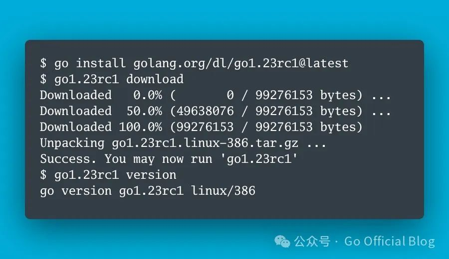

封面图："Heartfelt Doodlings" — The Web Event for Genshin Impact's new character: Sigewinne is now available.

<!-- 

封面图：Go 1.23 RC1 已经 released -->

## 🌟 AI 相关

[《Claude 3.5 Sonnet》](https://www.anthropic.com/news/claude-3-5-sonnet)。这篇由Anthropic团队撰写的文章介绍了最新发布的Claude 3.5 Sonnet模型。Claude 3.5 Sonnet在速度和智能方面设立了新的行业标准，能够高效处理复杂任务，如上下文敏感的客户支持和多步骤工作流程。该模型通过内部编码评估展示了强大的编码能力，且在视觉任务中表现卓越。此外，文章还介绍了新功能Artifacts，提供了一个动态工作空间，使用户可以实时查看、编辑AI生成的内容。Anthropic还强调了其在安全性和隐私保护方面的承诺。Claude 3.5 Sonnet现已在多个平台上上线，包括Claude.ai、iOS应用、Anthropic API、Amazon Bedrock和Google Cloud的Vertex AI。

[《NUS、清华提出STAR:一句话生成高质量4D Avatar，代码已开源》](https://mp.weixin.qq.com/s/-jj552KKJLZ-Y4WnwzJuRg)。本文作者Chai Zenghao介绍了由新加坡国立大学和清华大学团队提出的“STAR”算法。该算法利用骨骼感知技术从文本生成高质量4D Avatar，显著提高了虚拟人物的外观和动作真实度。STAR解决了T2I模型生成中的多面问题、域间隙和动画穿模等挑战，并通过结合T2I和T2V扩散模型与混合SDS方法优化Avatar的几何、纹理和动作。该技术展示了在虚拟人生成领域的显著进步，提升了生成效果及一致性。代码现已开源。

[《从LLM中完全消除矩阵乘法，效果出奇得好，10亿参数跑在FPGA上接近大脑功耗》](https://mp.weixin.qq.com/s/F-wOCZgpc3YksqsHjvY2nw)。本文作者王菁介绍了加州大学圣克鲁兹分校等机构研究者提出的MatMul-free语言模型，通过在密集层中使用加法和自注意力类函数中使用元素级乘积，完全消除了矩阵乘法的需求。实验表明，该模型在十亿参数尺度下保持了强大的性能，并且在优化内核和FPGA自定义硬件方案下，显著减少了内存和功耗消耗。此外，研究者在扩展模型规模时发现其性能与最先进的Transformer逐渐接近，为实现大规模语言模型的高效和低成本提供了新思路。项目代码已开源。

[《使用Coze(扣子)定制一个Android领域的专家》](https://mp.weixin.qq.com/s/hPU3XfKLBs7H9WBiFC2AjQ)。本文作者王菁介绍了如何使用字节跳动的扣子平台创建一个Android领域的智能专家。文章详细讲解了从设置基础信息、定义人设、添加联网搜索和绘图插件、建立知识库、设置个性化音色到通过工作流添加定制任务的全过程。通过这些步骤，用户可以创建一个能够回答Android相关问题的智能专家，并将其发布在豆包App上供终端用户使用。同时，作者分享了添加和测试插件、工作流的实际操作和经验，为实现高效的智能助手提供了有价值的指导。

[《一篇大模型Agent工具使用全面研究综述》](https://mp.weixin.qq.com/s/rxELLnxVNgBfHmfY6SnEnA)。本文详细介绍了使用大型语言模型（LLMs）进行工具学习的研究进展。作者王菁分析了工具学习的优势，包括增强知识获取、专业技能、自动化与效率、以及交互能力。同时，文章从任务规划、工具选择、工具调用和响应生成四个关键阶段对工具学习进行了系统性审查。通过引入新的工具学习范式和方法，使得LLMs能够更好地处理复杂问题，提高模型的可解释性和用户信任。该研究为新来者提供了宝贵的系统性指导和全面的理论基础。

[《无需人类或GPT-4打标签!南大&旷视研究院无监督范式大幅降低视觉大模型对齐成本》](https://mp.weixin.qq.com/s/ynSchFDQCBto258PwTGhJg)。本文作者王菁介绍了南大与旷视研究院推出的一种无监督范式，用于解决视觉大模型的偏好对齐问题。研究团队通过构造偏好样本对，提出了Self-Supervised Visual Preference Alignment（SeVa）范式，在无需GPT-4或人类打标签的情况下，显著提高了视觉语言模型（VLM）的指令遵循能力和用户感受效果。SeVa基于LLaVa-1.5-7B/13B模型，并通过实验在多个benchmark上证明其优越性。研究结果表明，无监督方法可以有效降低成本并提高模型性能，为视觉大模型的发展提供了新方向。项目代码和论文已开源。

[《墙裂推荐!Karpathy大模型培训课LLM101n上线了，非常基础》](https://mp.weixin.qq.com/s/lHcqkUSqMuBTFsFE3CzB5Q)。本文作者王菁详细介绍了由Andrej Karpathy推出的大语言模型培训课程《LLM101n》。该课程旨在从基础到高级，教授如何从零开始构建一个类似于ChatGPT的大型语言模型。课程内容涵盖从语言建模、机器学习基础、多模态、强化学习到模型部署等多个方面。通过Python、C和CUDA的实际操作，学员将深入理解AI、LLM和深度学习的核心原理。课程的大纲包括语言模型的基础概念、优化方法、设备和精度管理、数据处理与推理、微调与部署等核心主题。Karpathy的这一课程以实践为导向，为希望理解并构建大语言模型的学习者提供了详尽而实用的指导。

[《斯坦福 |提出多阶段LLM编程指令示例优化器:MIPRO，复杂任务准确率提升13%!》](https://mp.weixin.qq.com/s/GcLVLRADYB6LFZBMGEUFlg)。本文作者王菁详细介绍了斯坦福大学提出的多阶段语言模型（LLM）编程指令示例优化器MIPRO。MIPRO旨在通过优化每个阶段的指令提示，最大化下游任务指标，克服现有单阶段优化方法的局限。研究通过将复杂问题分解为多阶段任务，并引入贝叶斯优化技术，成功提升了如Llama3-8B等模型在多个项目上的性能，最高提升达13%。MIPRO通过其灵活性和高效率，为复杂任务的语言模型优化提供了创新性的解决方案。

[《RePrompt:提示词自动化优化策略》](https://mp.weixin.qq.com/s/R6ZsMZwiHNGcfVowUwPvaQ)。本文作者王菁详细介绍了RePrompt，这是一种为大型语言模型代理设计的自动提示优化策略。RePrompt通过分析与语言模型（LLM）代理的交互历史，对提示中的指令进行逐步优化，类似于“梯度下降”。其核心思想是通过优化提示，使得LLM在特定领域内更好地规划，并提升不同推理任务的性能。RePrompt不需对提示词进行精心编写，通过交互式动作生成和逐步优化，显著提高LLM在代码生成、旅行规划和机器人控制等应用中的表现。研究表明，使用RePrompt，LLM的推理任务准确率显著提升，展示了自动提示工程在实际应用中的潜力。

[《多模态大模型VLMs一年多的进展与思考》](https://mp.weixin.qq.com/s/m925xVwSLW0I7RTT1Mgxdg)。本文作者王菁探讨了视觉-语言模型（VLMs）在过去一年中的研究进展与应用。文章回顾了从ChatGPT到支持多模态输入的GPT-4的发布，VLMs技术的飞速发展，并探讨了代表性工作如LLaVA的实现和优化、对高分辨率和训练数据的改进、以及模型结构和图像生成技术的发展。此外，文章还探讨了视觉对LLM智能提升的潜力，提出VLMs尽管尚未与Diffusion方法一样广泛应用，但在增强机器感知能力、提高学习效率和纠正认知偏差方面展示了巨大潜力。文章为理解VLMs的未来趋势与应用提供了综合视角。

[《怎样让 PPO 训练更稳定？早期人类征服 RLHF 的驯化经验》](https://mp.weixin.qq.com/s/eU3T7Y2xefTDRfO94VIV1A)。本文作者王菁介绍了如何稳定且有效地训练增强学习中的顶流算法PPO，并分享了在RLHF（人类反馈强化学习）中的成功经验。文章详细探讨了Reward Model的训练方法，指出了仅拉开得分差会导致钻牛角尖的问题，并提出在Loss中加入对好样本的LM loss以保持模型的语言能力。此外，文章分析了PPO训练中的常见问题如模式崩溃，并提出了通过监控KL、Response Length、Perplexity等指标来及时发现问题的方法。作者还分享了Score Normalization & Clipping技巧，以及Policy Loss设计中的关键步骤，包括重要性采样和KL-惩罚。最后，文章提出了最优策略集合（PPO-max）的一套推荐策略，如reward normalize、token KL penalty等，为PPO训练提供了实践指导。

[《Runway新模型Gen-3 Alpha效果炸裂，创始人要做出比 Sora 更好的文生视频模型的承诺兑现，目前接受付费使用申请》](https://mp.weixin.qq.com/s/gnWRDgNAFFs1a1D4RX4-1g)。本文作者王菁介绍了Runway发布的新视频生成基础模型Gen-3 Alpha。作为Runway在AI视频生成领域持续投入和技术进步的标志，Gen-3 Alpha不仅是对先前模型的改进，更是通过用户反馈和技术研究后的全新进化。新模型引入了先进的语义分割技术和优化的渲染算法，显著提升了视频生成的自然度和逼真度。在用户体验和性能方面，Gen-3 Alpha也有了明显的提升，并得到了高度稳定性的保证。Runway的这一创新不仅兑现了其创始人比Sora更好的模型承诺，还通过在线教程和社区活动，推广了AI视频生成技术。

[《Multi-Head RAG:多头注意力的激活层作为嵌入进行文档检索》](https://mp.weixin.qq.com/s/MceI21zmgVqBnIpjohIwpg)。本文作者SACHIN KUMAR介绍了一种新的文档检索方案Multi-Head RAG (MRAG)，该方案利用Transformer的多头注意力层作为嵌入，而不是传统的解码器层激活，从而提高文档检索的效果。MRAG通过在嵌入过程中处理多个注意头的激活，捕获文本的多面性，优化了检索准确性和相关性。文章详细描述了MRAG的数据准备、嵌入构建、查询执行等步骤，并通过多项实验和实际用例（比如法律文件合成和工业事故分析），展示了MRAG相较于标准RAG在检索成功率和性能方面的显著提升。MRAG不仅提升了检索效果，还保持了与标准RAG相同的嵌入空间，不增加存储需求。论文还提供了相关代码链接，为研究者和工程师提供了实现参考。

[《SOFTS: 时间序列预测的最新模型以及Python使用示例》](https://mp.weixin.qq.com/s/Xeu9XQhvz3wubK6d7Sd7qQ)。本文作者王菁介绍了2024年4月提出的全新时间序列预测模型SOFTS（Series-cOre Fused Time Series）。SOFTS通过引入STar聚合调度（STAD）模块，集中学习不同时间序列之间的交互关系，在多变量预测中表现尤为出色。文章详细讲解了SOFTS的架构，包括序列归一化、嵌入和STAD模块的操作原理，并通过实验证明了其在单变量和多变量任务中的优秀性能。此外，文章还提供了具体的Python代码示例，演示如何使用SOFTS模型进行预测，为研究者和工程师提供了实践指导。

[《魔搭社区GGUF模型怎么玩!看这篇就够了》](https://mp.weixin.qq.com/s/z5KgulufX0IEP6G6lkD_nQ) 。本文作者魔搭社区介绍了Qwen2系列的大模型家族发布的GGUF格式模型及其使用方法。文章详细讲解了通过包括llama.cpp、Ollama、LM Studio等工具进行模型下载、解析和应用的流程。内容覆盖了从CLI命令行工具、Python SDK到页面下载的方式，并对不同模型推理工具进行了比较，提供了逐步安装和使用指南。文章为初学者提供了易于上手的操作方法，让用户即便在仅配备CPU的笔记本上，也能够体验并应用顶尖的AI技术。通过详细的图文和代码示例，帮助开发者顺利部署并运行GGUF大模型。

[《将强化学习重新引入 RLHF》](https://mp.weixin.qq.com/s/eyLnBTskZhlKcwghzqHmhQ)。本文作者Shengyi Costa Huang和Arash Ahmadian介绍了RLOO（REINFORCE Leave One-Out）训练器，一种替代PPO的新型在线RLHF训练算法。RLOO通过减少GPU内存占用和加速收敛时间，使得在线强化学习变得更加易用和高效。与PPO相比，RLOO的vRAM使用量减少50-70%，运行速度提高2-3倍，并在响应胜率上优于DPO等离线方法，尤其是在大规模模型上。文章详细描述了RLOO的工作原理，包括奖励基线的计算、训练过程中的每步操作，并提供了实验证明RLOO的有效性和实现代码。通过RLOO，可以更高效地进行在线RLHF训练，提升模型的响应质量。

[《过去一年有关大模型应用构建的干货经验之战略篇》](https://mp.weixin.qq.com/s/Nh7l_ly791thmsXG7hm5Cw)。本文作者Eugene Yan与Bryan Bischof等人分享了他们在大模型应用构建中的经验。文章从战术、运营和战略三方面剖析了大模型的开发与落地。战略篇强调深思熟虑的规划和优先级排序，提出了“在产品市场契合度(PMF)之前不使用GPU”等观点，探讨了自建与购买模型的决策依据、如何围绕模型建系统以迭代精品，以及低成本认知趋势对未来应用的影响。通过实战经验总结提供了一条从原型到可靠产品的现实路径。

[《过去一年有关大模型应用构建的干货经验之运营篇》](https://mp.weixin.qq.com/s/XM9GfNPe-0Meb6MLMxhJPw)。本文由Eugene Yan和Bryan Bischof等人撰写，重点分享了大模型（LLM）应用在数据、模型、产品和人员等方面的运营经验。文章涵盖了LLM在生产过程中如何审查输入输出、解决开发-生产数据偏差，保持模型版本化，以及跨模型提示迁移的难点。还探讨了如何设计、人机交互的用户体验，优先排序需求，以及培养团队实验文化。通过实际案例展示了LLM在不同模型和版本间的表现、评估方法及优化策略，提供了综合的运营指南。

[《过去一年有关大模型应用构建的干货经验之战术篇》](https://mp.weixin.qq.com/s/1_kfUm7A4dbJ6owOO_mHfQ)。本文由Eugene Yan、Bryan Bischof等人撰写，详细介绍了在大模型应用构建中的战术经验。文章涵盖了提升质量和可靠性的提示技巧、构建检索增强生成（RAG）、应用流程工程、评估和监控的最佳实践和常见陷阱。具体内容包括n-shot提示、chain-of-thought提示技术、结构化输入输出、信息检索策略、缓存的重要性以及微调的时机。通过实际案例，文章探讨了如何优化上下文、组合工作流以及评估生成的输出质量，提供了极具实用性的战术建议。

[《OpenAI前CTO Ilya推荐的30篇文章，认真读完将理解当下90%的AI技术(2)》](https://mp.weixin.qq.com/s/DUYp2EaMuUS8JOV2cnk8cA)。本文同样由Ilya推荐，继续介绍剩余的AI关键论文，包括《Deep Residual Learning for Image Recognition》中的深度残差学习、《MULTI-SCALE CONTEXT AGGREGATION BY DILATED CONVOLUTIONS》的膨胀卷积、多尺度上下文聚合、《Neural Message Passing for Quantum Chemistry》在量子化学中的神经消息传递等。这些论文深入探讨了深度神经网络、语义分割、机器翻译等领域的前沿技术，展示了AI在不同应用方面的突破性进展。阅读这些论文有助于全面了解当前的AI技术和研究方向。

[《OpenAI前CTO Ilya推荐的30篇文章，认真读完将理解当下90%的AI技术(1)》](https://mp.weixin.qq.com/s/R1QeWD7maFjA4Avc0EUcyQ)。本文涵盖了Ilya与业内专家推荐的关键AI论文，包括Transformer开山之作《Attention Is All You Need》、Scott Aaronson探讨物理系统复杂性的《The First Law of Complexodynamics》、Andrej Karpathy强调RNN强大能力的《The Unreasonable Effectiveness of Recurrent Neural Networks》以及Geoffrey Hinton等人提出的深度学习革命性论文《ImageNet Classification with Deep Convolutional Neural Networks》。这些论文涵盖了从Transformer、RNN、LSTM到GPipe等多个重要领域，为深入理解当前AI技术提供了宝贵的资源。

[《长文梳理!近年来GPT系列模型的发展历史:从GPT-1到GPT-4o(前世、今生)》](https://mp.weixin.qq.com/s/v4TVgqffLEygE24RClrz7A)。文章作者详细回顾了从GPT-1到GPT-4o的演进历程。文章指出，大语言模型的快速发展始于GPT-1，经过GPT-2的大规模扩展与无监督预训练的尝试，到GPT-3引入的“上下文学习”技术，再到InstructGPT针对人类偏好对齐的改进。GPT-4进一步提升了模型性能，并支持图文双模态输入。最新的GPT-4o更是实现了多模态输入与输出的结合，展现了对文本、音频和图像的强化理解和生成能力。这些技术迭代展示了GPT模型在自然语言处理领域的持续革新和突破。

[《多头RAG:利用多头注意力提升复杂查询的检索准确性》](https://mp.weixin.qq.com/s/f1eAp2WsefgitkRDaIXt2Q)。本文介绍了一种名为“多头检索增强生成”（MRAG）的新方法，旨在解决大型语言模型（LLM）在处理多文档检索时的挑战。作者详细阐述了MRAG如何利用Transformer的多头注意力层激活作为键来检索不同方面的文档，提高复杂查询的检索准确性。通过实验评估和实际应用案例，MRAG在准确性和相关度上均表现出色，与传统RAG方法相比，相关性提升了20%。这篇文章证明了多头注意力机制在增强检索系统性能方面的潜力，并为未来研究提供了有效的参考和方法论。

[《今日arXiv最热大模型论文:清华大学:一个简单缩放让大模型利用长上下文能力提升15.2%》](https://mp.weixin.qq.com/s/86vqhDddAXhAvFYpcFacbg)。本文详细介绍了清华大学提出的通过扩展位置隐藏状态来减轻位置偏差的方法，显著提高了大模型在长上下文处理中的准确性。这种方法包括识别位置隐藏状态并按因子缩放，以减少因果掩码引起的注意力权重偏差，从而提升模型性能。在NaturalQuestions、KV检索和LongBench基准上，方法分别提高了9.3%、15.2%和4.7%的性能。通过详细实验与消融研究，证明了该方法在各种任务上的有效性与适应性，特别在长上下文任务中的显著改进，展示了大模型在处理长文档时性能显著改善的可能性。

[《欢迎 Stable Diffusion 3 加入 🧨 Diffusers》](https://mp.weixin.qq.com/s/HMwk3yn-ftugyrHzbBpnOg)。这篇文章介绍了Stable Diffusion家族的最新模型Stable Diffusion 3（SD3），现已登陆Hugging Face Hub，并可在🧨 Diffusers中使用。作者详细描述了SD3的主要特性、模型架构以及如何在Diffusers中进行使用。SD3模型具有20亿参数，包括三个不同的文本编码器（CLIP L/14、OpenCLIP bigG/14和T5-v1.1-XXL），并使用新提出的多模态Diffusion Transformer（MMDiT）模型和16通道的AutoEncoder模型。在内存优化方面，SD3引入了模型卸载和量化方法的多种手段，并详细展示了如何通过代码进行内存优化和性能提升。此外，还提供了使用DreamBooth和LoRA进行微调的代码示例，对SD3进行了详细的性能测量。文章为想要快速尝试和部署SD3模型的用户提供了全面的指导。

[《Nemotron-4 340B 技术报告:全面解读当前最强大语言模型的诞生过程》](https://mp.weixin.qq.com/s/3e4KaXNL0O9sdEPmIlrFfw)。本文介绍了NVIDIA发布的Nemotron-4 340B系列模型，该系列包括基础版、指导版和奖励版，专为在单台搭载8个GPU的DGX H100上以FP8精度部署而设计。作者详细描述了模型的训练过程、架构细节及其在各类任务上的卓越表现。报告还强调了98%以上的对齐数据均为合成生成，展示了合成数据生成对模型性能的显著提升。通过多轮对齐和训练迭代，该模型在多个测试数据集上超越了GPT-4，成为当前最强大开源语言模型。详细资料和代码也已开源，供研究和商业应用自由使用。

[《样本设计工程 (SDE) :如何设计更好的大模型微调样本》](https://mp.weixin.qq.com/s/pbPyxEjI48OrViBkDAXKjA)。本文作者郭必扬介绍了样本设计工程（Sample Design Engineering, SDE）的概念，系统探讨了大模型在下游任务微调样本设计方面的多种选择。实验表明，经过精心设计的微调样本能够显著提升大模型的任务表现。文章还特别提出了一种在多个复杂任务上均表现优异的样本设计方案，进一步探讨了SDE与提示工程（PE）的异同。通过大量实验验证，作者展示了如何通过细致样本设计，以较少的数据实现更好的模型微调效果。详尽的实验数据充分证明了SDE的实用性和潜在价值。

## ⭐️ Go & 云原生 & Rust 相关

[使用 Golang 实现高 IO 性能超边缘缓存服务器](https://juejin.cn/post/7380222254195834892)

[揭秘Go Telemetry](https://mp.weixin.qq.com/s/lBp1qRdgzCe0etr9rRTi_A)

[Go 1.23 RC1 已经 released](https://mp.weixin.qq.com/s/RWFowB1T7TZ63-GwYPXNUg)

[10 个提高生产力的 Go 小技巧](https://mp.weixin.qq.com/s/GG3QbKQz3wYKFPdmJjWtuA)

[聊一聊资深的 Go 开发者如何顺利转型到 Rust 开发](https://mp.weixin.qq.com/s/_4bSpc18clX2Z6gR4pbwqg)

[Go必知必会：探索内存操作的艺术--指针](https://mp.weixin.qq.com/s/_OB0TNt0K9EjVvpLo1rvJQ)

[深度解析服务发布策略之滚动发布](https://mp.weixin.qq.com/s/U22CsNSkOosDmXDHgg1R2g)

[万字长文：在 Go 中如何优雅的使用 wire 依赖注入工具提高开发效率？下篇](https://mp.weixin.qq.com/s/qpLimb2y9z12JixyQs0WzA)

[在 Go 中如何让结构体不可比较](https://mp.weixin.qq.com/s/jGOSjgHeqh5HaQd5icBvpA)

[为什么 Go 不学 Rust 用 ? 做错误处理](https://mp.weixin.qq.com/s/0mphuzSCmcLgd90I6ddr3w)

[Golang 极简的开发和快速部署](https://mp.weixin.qq.com/s/50RqAQmflA3kVuekfR8cDA)

[程序绑核和CPU亲和性](https://mp.weixin.qq.com/s/ETA-tWI_DW1kS4earL_iqg)

[Go 实现可复用的通用内存缓存](https://mp.weixin.qq.com/s/-3Zt8ZyMZAHFPTKHDvggVQ)

[一文搞定 Golang 反射 (Reflect)](https://mp.weixin.qq.com/s/WrG0KccMJSwUJAeCr-CFkQ)

[Go必知必会：map详解](https://mp.weixin.qq.com/s/Fygdos_msEaYMGIa226i5A)

[duckdb: 一个超火的数据库，背后公司只有18人](https://mp.weixin.qq.com/s/aAgDibroCEk0UQAI2NtZxg)

[Go 再讨论 catch error 模型，官方回应现状](https://mp.weixin.qq.com/s/eBfegl6fCtzQpmQkM9eTNA)

[Gopher的Rust第一课：Rust的依赖管理](https://mp.weixin.qq.com/s/UG-6UuqDiLX15dEZrGGrRA)

[atomic128](https://mp.weixin.qq.com/s/U5Ii6_lhkNzItQCHZIARrg)

## 📒 后端相关

[万字解析 mysql innodb 事务实现原理](https://mp.weixin.qq.com/s/dEgTmNioqjx5IyDTX4KE4g)

[接口性能优化的11个小技巧](https://mp.weixin.qq.com/s/RDvph7lcTGgLiJYC3MsPyQ)

[elasticSearch 是什么？工作原理是怎么样的](https://mp.weixin.qq.com/s/RUQXIyN95hvi2wM3CyPI9w)

[手把手带你从自建 MySQL 迁移到云数据库，一步就能脱胎换骨](https://mp.weixin.qq.com/s/xX4fvl4vjjfEI6ccra_DzQ)

## 📒 前端相关

[全网独家-万字长文入门前端全球化](https://mp.weixin.qq.com/s/qOGU5SdKgdhi6Mfi6wKNaA)

[前端可观测性系统建设](https://mp.weixin.qq.com/s/oTGR73vxBUvsM45UkpB-Fw)

[React19 为我们带来了什么](https://juejin.cn/post/7380650414414807074)

[Tailwind轻松实现夜间模式，能跟随系统又能手动控制！](https://mp.weixin.qq.com/s/ogAc-0aUyph4CscrwQMSyA)